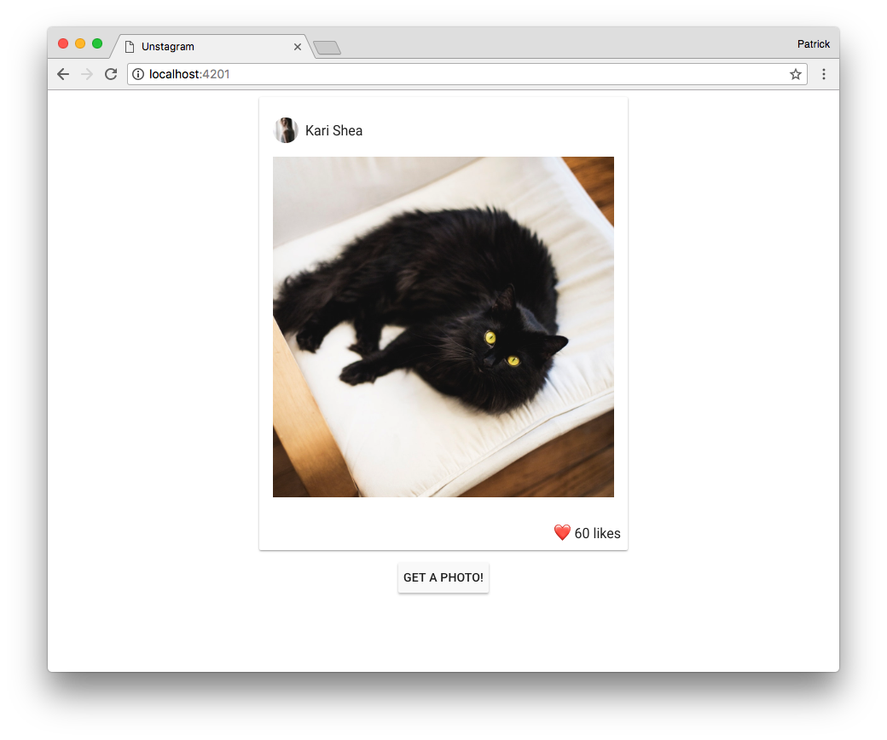

# Unstagram

## Assignment

Your assignment is to remove the "Get a Photo!" button and replace it with infinite-scroll functionality. The app should load more images and append them to the bottom of the `timeline` when the user reaches the bottom of the page. You may modify the existing project in whatever way you see fit, however we do ask that you refrain from using any kind of infinite-scroll plugin.

Feel free to dress the page up with UX/UI improvements at your own discretion–this is not required.

### Submission
Once you are finished, open a pull-request to [PartCycleTech/unstagram](https://github.com/PartCycleTech/Unstagram/compare)

## Setup

### Prerequisites

You will need the following things properly installed on your computer.

* [Git](https://git-scm.com/)
* [Node.js](https://nodejs.org/) (with npm)
* [yarn](https://yarnpkg.com/en/docs/install)
* [Ember CLI](https://ember-cli.com/)
* [Google Chrome](https://google.com/chrome/)

### Installation

* Fork the project
* `git clone https://github.com/<your-username>/unstagram.git`
* `cd unstagram`
* `yarn`

### Running / Development

* `ember serve`
* Visit your app at [http://localhost:4200](http://localhost:4200).

#### Linting

* `npm run lint:js`
* `npm run lint:js -- --fix`

## Further Reading / Useful Links

* [ember.js](https://emberjs.com/)
* [ember-cli](https://ember-cli.com/)
* [ember-paper](https://miguelcobain.github.io/ember-paper/)
* [unsplash.js](https://github.com/unsplash/unsplash-js)
* Development Browser Extensions
  * [ember inspector for chrome](https://chrome.google.com/webstore/detail/ember-inspector/bmdblncegkenkacieihfhpjfppoconhi)
  * [ember inspector for firefox](https://addons.mozilla.org/en-US/firefox/addon/ember-inspector/)
